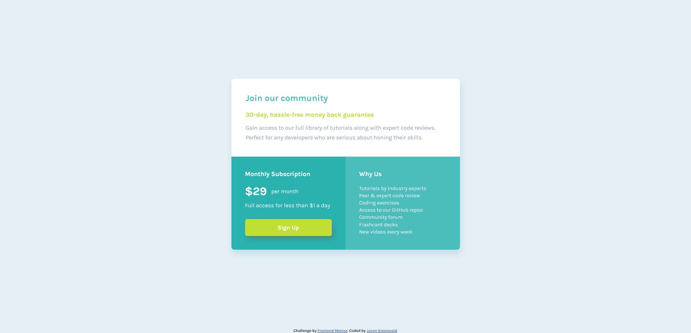

# Frontend Mentor - Single price grid component solution

This is a solution to the [Single price grid component challenge on Frontend Mentor](https://www.frontendmentor.io/challenges/single-price-grid-component-5ce41129d0ff452fec5abbbc). Frontend Mentor challenges help you improve your coding skills by building realistic projects. 

## Table of contents

- [Overview](#overview)
  - [The challenge](#the-challenge)
  - [Screenshot](#screenshot)
  - [Links](#links)
- [My process](#my-process)
  - [Built with](#built-with)
  - [What I learned](#what-i-learned)
  - [Continued development](#continued-development)
  - [Useful resources](#useful-resources)
- [Author](#author)
- [Acknowledgments](#acknowledgments)

## Overview

### The challenge

Users should be able to:

- View the optimal layout for the component depending on their device's screen size
- See a hover state on desktop for the Sign Up call-to-action

### Screenshot



### Links

- Solution URL: [Add solution URL here](https://your-solution-url.com)
- Live Site URL: [Add live site URL here](https://your-live-site-url.com)
- GitHub URL: 

## My process

- Review the images and style guide for user requirements.
- Review Slack to see what feedback others have received about this project.
- Measure in Illustrator.
- Create class names
- Style CSS
- Test/compare with design
- Move on to desktop version and repeat
- Research topics as needed (such as using buttons vs. links).

### Built with

- Semantic HTML5 markup
- CSS custom properties
- Flexbox
- CSS Grid
- Mobile-first workflow

### What I learned

I employed Grid for the first time! 

To see how you can add code snippets, see below:

```css
@media screen and (min-width: 921px) {
    .card {
        width: 635px;
        display: grid;
        grid-template-columns: 1fr 1fr;
        grid-template-rows: auto auto;
    }
```

I also coded my first transition. The challenge mentioned a :hover for the button. I took this time to learn the very basics of transitions. I made the button a little larger while simultaneously increasing the size of the box-shadow in order to create the sense that the button was moving away from screen toward the user enticing them to click the button.

```css
    box-shadow: 6px 9px 15px -3px hsl(179, 31%, 40%);
    transition: box-shadow 100ms, transform 100ms;
}

.card__signup-btn:hover {
    box-shadow: 9px 12px 15px 0px hsl(179, 31%, 40%);
    transform: scale(1.05);
}
```

### Continued development

- I need to keep working on learning Grid - I barely tipped my toes into those waters.
- Learn more about CSS transitions and animations.
- I would like to reflect on my project workflow and see if there are areas I can improve.

### Useful resources

- [CSS Grid & Flexbox eBook by Shruti Balasa](https://shrutibalasa.com/) - I mentioned this book when I was learning Flex. It was $10 and I've found it to be an indispensable resource.
- [An Interactive Guide to CSS Transitions by Josh W. Comeau](https://www.joshwcomeau.com/animation/css-transitions/) - Another gem courtesy of Josh W. Comeau's website. I HIGHLY recommend reading this one.

## Author

- Git Profile - https://github.com/jaycgreenwald
- Frontend Mentor - [@jaycgreenwald](https://www.frontendmentor.io/profile/jaycgreenwald)
- Twitter - [@jaycgreenwald](https://www.twitter.com/jaycgreenwald)

## Acknowledgments

This is where you can give a hat tip to anyone who helped you out on this project. Perhaps you worked in a team or got some inspiration from someone else's solution. This is the perfect place to give them some credit.
